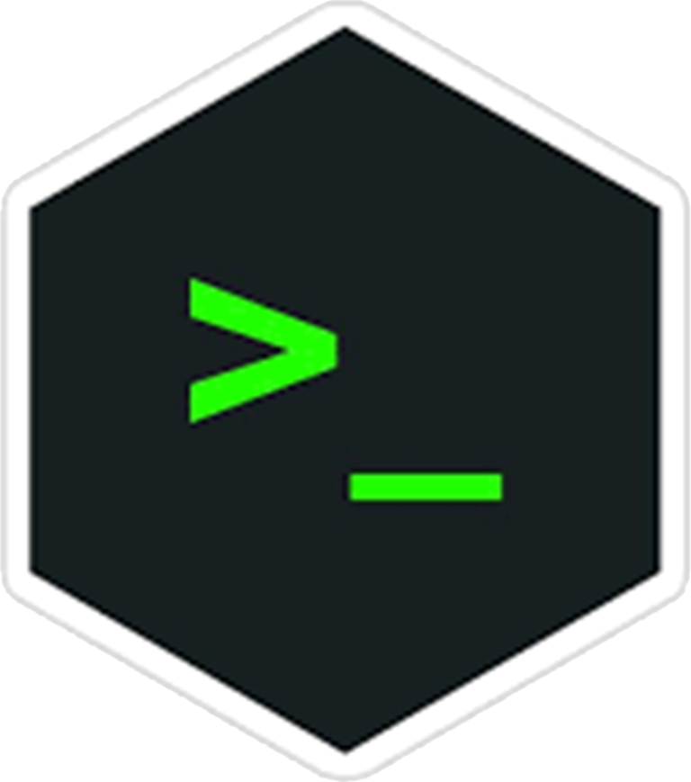

# 
Bash

---

> ***Bash*** is the shell, or command language interpreter, for the GNU operating system. The name is an acronym for the ***‘Bourne-Again SHell’***, a pun on Stephen Bourne, the author of the direct ancestor of the current Unix shell sh, which appeared in the Seventh Edition Bell Labs Research version of Unix.

> ***Bash*** is largely compatible with sh and incorporates useful features from the ***Korn shell ksh*** and the ***C shell csh***. It is intended to be a conformant implementation of the ***IEEE POSIX Shell*** and Tools portion of the IEEE POSIX specification (*IEEE Standard 1003.1*). It offers functional improvements over ***sh*** for both interactive and programming use.

> While the GNU operating system provides other shells, including a version of ***csh***, ***Bash*** is the default shell. Like other GNU software, ***Bash*** is quite portable. It currently runs on nearly every version of Unix and a few other operating systems - independently-supported ports exist for MS-DOS, OS/2, and Windows platforms.
